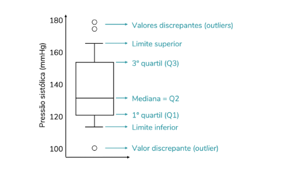
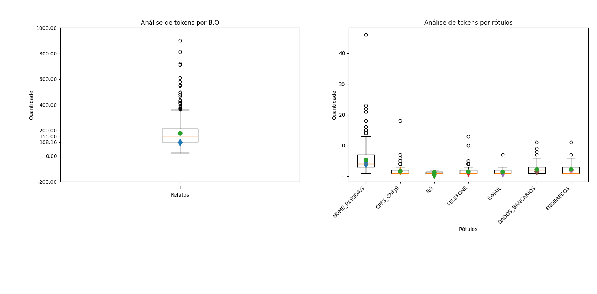

# Análise exploratória de dados so projeto de Anonimização de dados
<p>Essa análise serve para fazer o cálculo de tokens do projeto de anonimização de dados, usando as tecnologias Postgres, Python e o modelo de llm gpt-3.5-turbo"</p>

# Conectar ao Banco de dados

## Antes de rodar o código é preciso criar o arquivo .env e configurar com os valores corretos. O .env.example mostra um exemplo de como deveria ser.

### Crie um arquivo .env no diretório principal e coloque as sequintes informações
```bash
PG_HOST= host do db
PG_PORT= porta
PG_DBNAME= nome da base de dados
PG_USER= usuario 
PG_PASSWORD= senha
```

### Para criar o ambiente virtual, instalar os pacotes necessários e rodar o código.
```bash
python -m venv .venv
source .venv/bin/activate
pip install -r requirements.txt
python main.py
```

### Para sair do virtual enviroment

```bash
deactivate
```

Para fazer querys basta utilizar um comando de execute dentro do with presente no main.py, ficando parecido ao exemplo abaixo:

```python
if __name__ == "__main__":
  # usa configurações do .env via config.get_db_config()
  cfg = get_db_config()

  # exemplo de uso seguro com context manager
  with PostgresDB(**cfg) as db:
    print("Conectado?" , db.is_connected())
    base = db.execute("SELECT * FROM base_dados")
    print("Base: ", base)
```

# Informações da análise que não informa no boxplot

<p>Análise de rótulos por B.O com ou e sem os valores None e Null antes de tokenizar</p>

| Rótulo | Média C/N | Média S/N |
| --- | --- | --- |
| NOME_PESSOAIS | 601 | 449 |
| CPFS_CNPJS | 601 | 177 |
| RG | 601 | 15 |
| TELEFONE | 601 | 333 |
| E-MAIL | 601 | 66 |
| DADOS_BANCARIOS | 601 | 206 |
| ENDERECOS | 601 | 83 |

<p>Símbolos usados no boxplot</p>

| Símbolo | Valor |
| --- | --- |
|  | Média |
|  | Desvio Padrão |

<p>As demais informações estão na análise explorátória mais abaixo</p>

# Explicando o código 

## Aqui nós estamos estamos realizando as buscas sql e depois por segurança fecha a conexão com o banco de dados e faz a filtragem dos dados Null e None e realiza o cálculo dos tokens

### Aqui fazermos a conexão e a busca e depois fechamos o banco de dados.

```python
    sql = '''SELECT relato
            FROM base_validada
        '''
        
    data_relato= db.execute(sql)
    sql = '''SELECT 
              nomes_pessoais_rot_final,
              cpfs_cnpjs_rot_final,
              rg_rot_final,
              telefones_rot_final,
              emails_rot_final,
              dados_bancarios_rot_final,
              enderecos_rot_final
              FROM base_validada;
      '''

    data_query_rotulo = db.execute(sql)

    db.close()
```

### Aqui criamos as Colunas das listas com os nomes

```python
    columns_data = (
                     "NOME_PESSOAIS",
                     "CPFS_CNPJS",
                     "RG",
                     "TELEFONE",
                     "E-MAIL",
                     "DADOS_BANCARIOS",
                     "ENDERECOS")
      
    data_rotulos = [[] for _ in range(len(columns_data))]
```

###  Aqui pegamos a query  dos relatos e dos rótulos e adicionamos cada tipo de rótulo em uma lista no e quebramos os tokens e o mesmo com os relatos.

```python
def count_tokens_bos(data):
    return [len(str(report).strip().split()) for report in data]

def count_labels_bos(data):
    new_data = []
    for column in range(len(columns_data)):
      labels = [len(str(row[column]).split(',')) for row in data if row[column] is not None]
      new_data.append(labels)
    return new_data 

data_tokens_labels = count_labels_bos(data_query_labels)
data_tokens_reports = count_tokens_bos(data_query_reports)

media_tokens_reports = median(data_tokens_reports)
stdev_tokens_reports = stdev(data_tokens_reports)
```
## Como Funciona um BoxPlot


## Resultados do nosso boxplot




## Conclusões da análise mais detalha

### Qual a quantidade média ,desvio padrão, maior e menor quantidades de tokens dos BOs?
| Média | Desvios Padrão | Maior | Menor |
| --- | --- | --- | --- |
| 155.0 | ~108.158 | 902 | 24 |

### Quantos tokens existem por tipo de rótulo?
| Nomes | CPFs ou CNPJ | RG | TELEFONE | E-MAIL | DADOS BANCARIOS | ENDEREÇOS |
| --- | --- | --- | --- | --- | --- | --- | 
| 2318 | 278 | 9 | 489 | 77 | 427 | 162 |